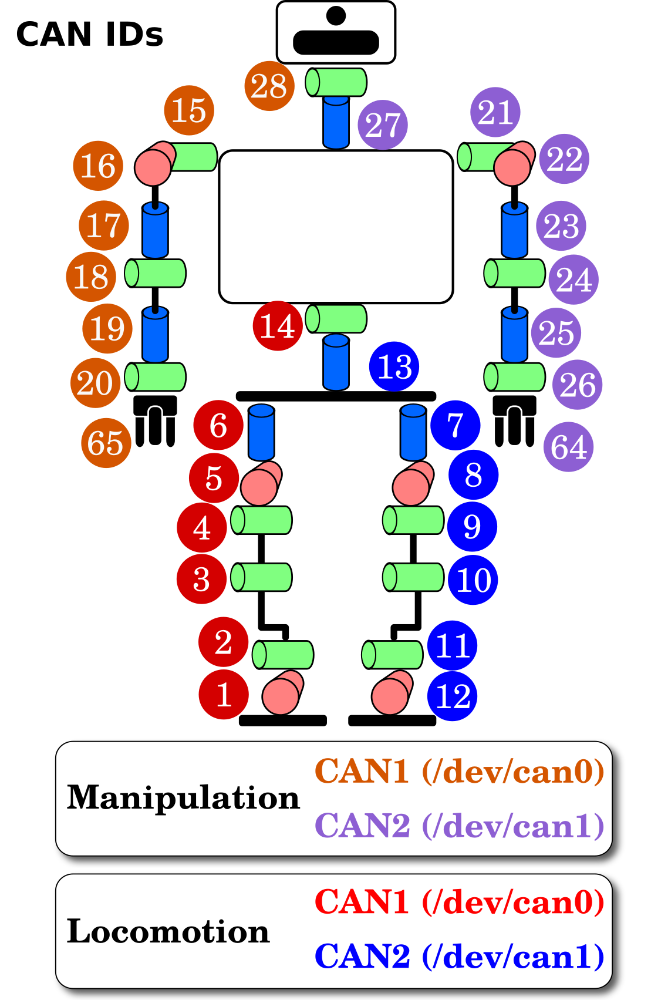
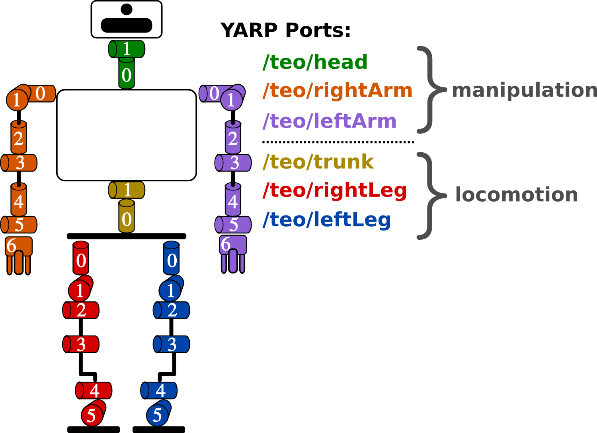
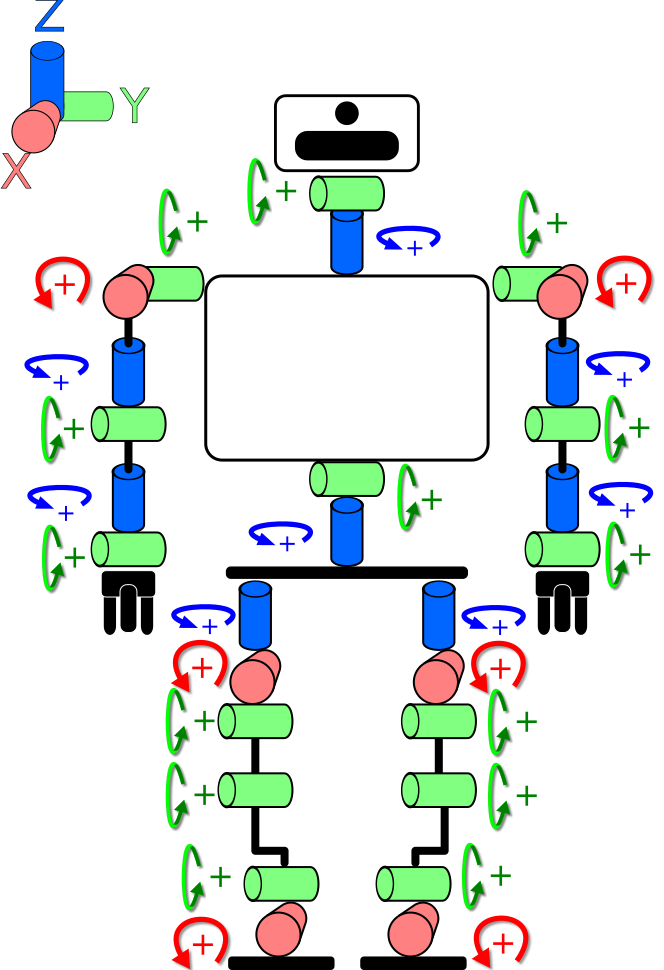
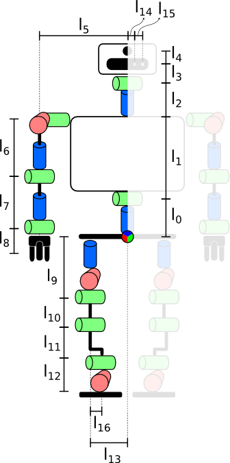
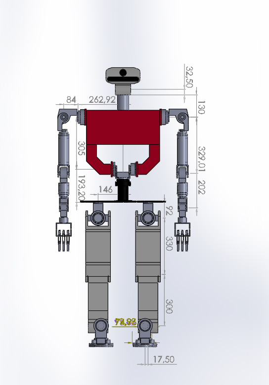
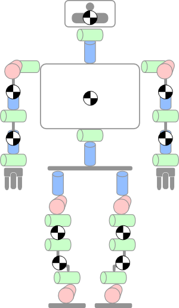
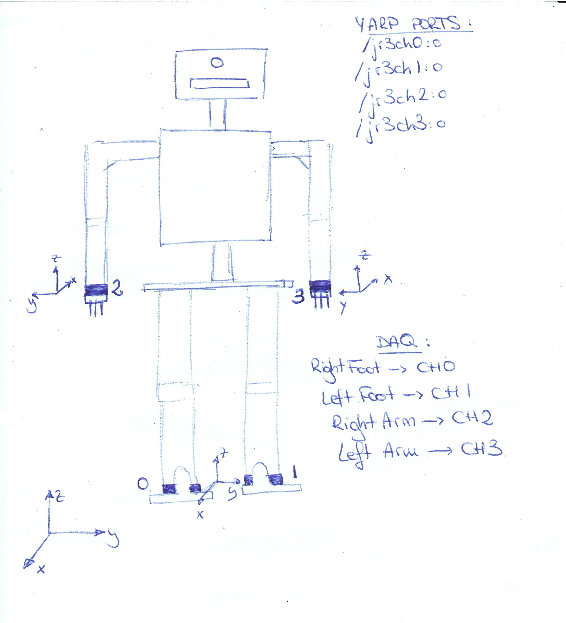

# Appendix A: TEO Diagrams

## Joint Indexes

| Joint Indexes (CAN bus) |Joint Indexes (YARP ports) |
| ------------- | ------------- |
|  |  |

## Joint Directions of Rotation
| Joint Directions of Rotation |
| ------------- |
|  |

## DH Parameter Table and Coordinate System Drawing
Content moved to https://github.com/roboticslab-uc3m/teo-software-manual/blob/master/appendix/a-teo-diagrams.md

## Link Lengths
  |  

## COGs
| COGs |
| ---------- |
|   |

## F-T sensors
|  F-T sensors  |
| ---------- |
|   |

## JR3 wrists drawings
| F-T sensors  |
| ---------- |
| [File:Jr3 50M31 corregido.pdf](http://robots.uc3m.es/index.php/File:Jr3_50M31_corregido.pdf) |

## TEO DH Parameter Table

- [DH Parameter Table](../assets/dh-table.md)

## TEO DH Coordinate Systems Drawing

## Sources for Develop
Migrating to: https://github.com/roboticslab-uc3m/teo-software-manual
