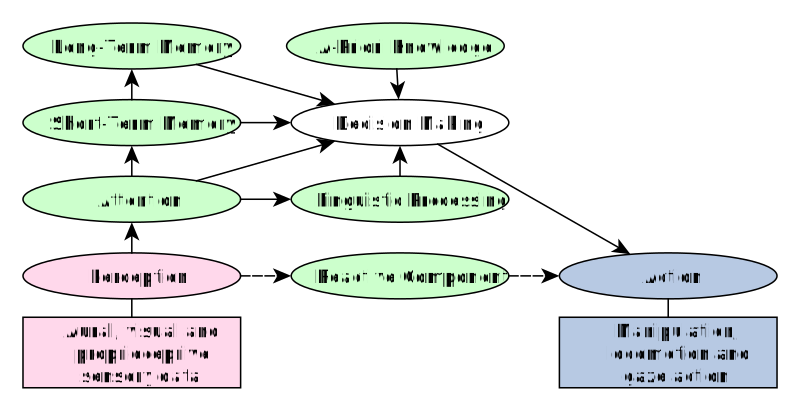

# Cognitive Architecture

Conventionally, we have said that there is technically no fixed software architecture for TEO. We use [YARP](http://www.yarp.it/) to implement a loosely coupled program and library infrastructure as described by the [Component-Based Software Engineering (CBSE)](https://en.wikipedia.org/wiki/Component-based_software_engineering) paradigm. XML files describe modules and connections, which can be administered throughout the [TEO cluster](https://robots.uc3m.es/teo-developer-manual/network-information.html) manually or using a program called [yarpmanager](http://www.yarp.it/yarpmanager.html). During normal operation:

1. The [teoBase XML](https://github.com/roboticslab-uc3m/teo-configuration-files/blob/master/share/applications/teoBase.xml) is launched for basic robot services.
1. The [teoTools XML](https://github.com/roboticslab-uc3m/teo-configuration-files/blob/master/share/applications/teoTools.xml) is launched to assure correct operation of each teoBase service.
1. A final application-level XML is launched, from one of the [demonstration](overview/demonstration.md) or [research](overview/research.md) repositories.

A traditional setup of the components for an application involving gaze control and manipulator gesture, extracted from the [teo-follow-me](https://github.com/roboticslab-uc3m/teo-follow-me) demonstration repository, is depicted below.

More recently, the TEO Cognitive Architecture has gained similarities to the [ICub Cognitive Architecture](http://wiki.icub.org/wiki/ICub_Cognitive_Architecture) and [TRoPOCALs](https://pdfs.semanticscholar.org/12fb/ed65d4c22fe1bf3fd7f2bc353e5e0f493cdc.pdf), as well as many other bio-inspired embodied cognition architectures.

We highlight the following aspects:

- A Decision Making (DM) process is governed by managing a-priori knowledge, short and long term memory, and instantaneous attention mechanisms.
- The DM directly operates in the robot motor actuation space of manipulation, locomotion and gaze control.
- Attention spans from multimodal perceptual aural, visual, and proprioceptive sensory data.
- Linguistic input is partially processed from the attention mechanism and also fed into the DM.
- An optional reactive component can be activated, enabling a pathway that directly maps from the sensor data to the motor space.

