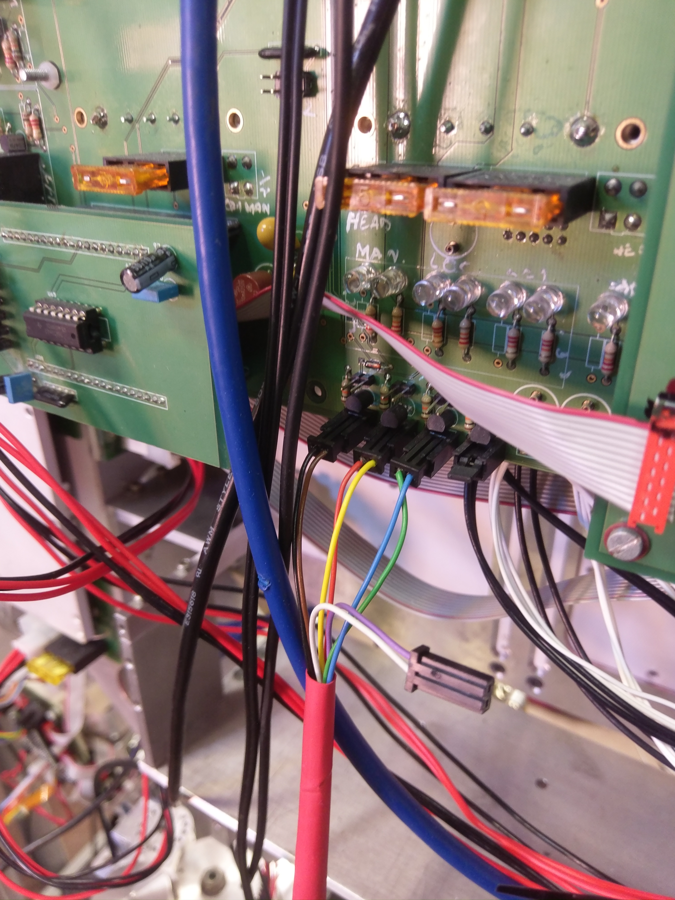
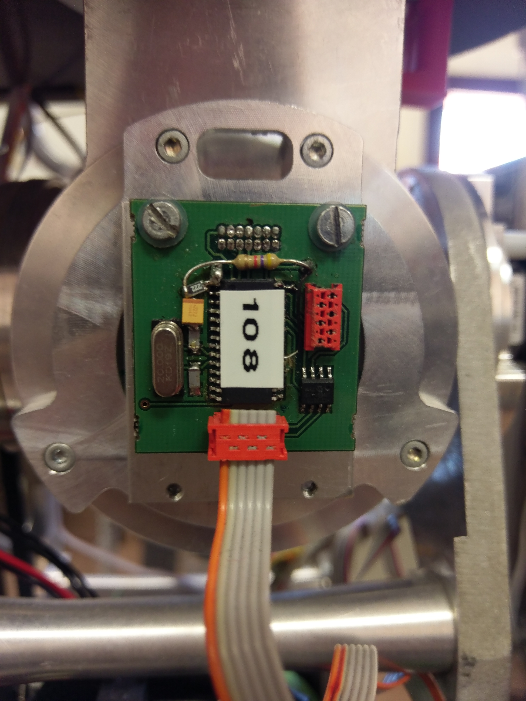
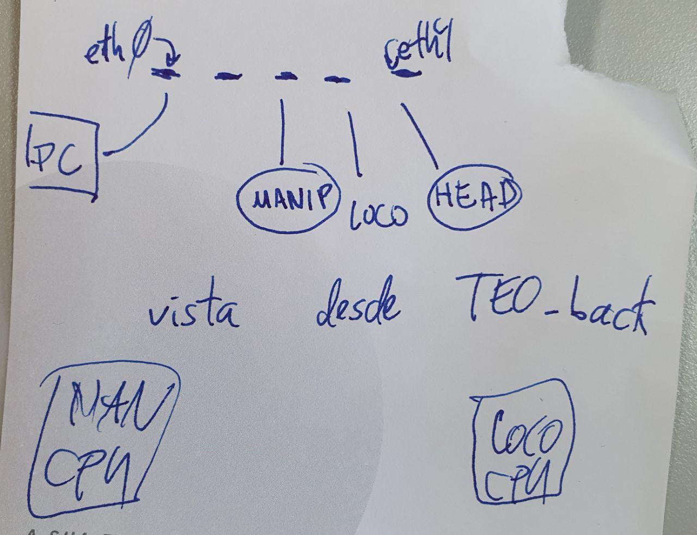
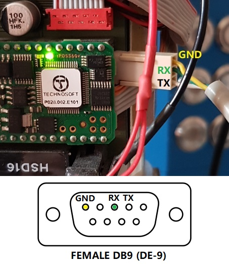

# Connectors

| **Emergency Buttons Connectors** | **JR3 Circuit Connectors** | **Technosoft IPos Connectors** | **Cui Absolute Circuit Connectors** |
| --- | --- | --- | --- |
|  |  |  |  |

| **CAN Bus Connector** |  **Internal Router Connectors** | **iPOS RS232 Connector**
| --- | --- | --- |
|  |  |  |
