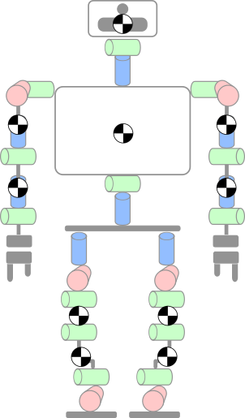

# Diagrams

## Joint Indexes

| Joint Indexes (CAN bus) |Joint Indexes (YARP ports) |
| ------------- | ------------- |
|  |  |

## Joint Directions of Rotation

| Joint Directions of Rotation |
| ------------- |
|  |

## DH Coordinate Systems


## Link Lengths


## Link Names

```mermaid

```

[teo-link-names.pdf](fig/teo-link-names.pdf)

{ type=application/pdf style="width: 100%; height: 967px;" }

## COGs

| COGs |
| ---------- |
|   |

## F/T sensors

### F/T sensors (Ports, channels and coordinate systems)

| F/T sensors (Ports and channels) |
| ---------- |
|   |

### F/T sensors (Mechanical)

[Jr3 50M31 corregido.pdf](fig/Jr3_50M31_corregido.pdf)

{ type=application/pdf style="width: 100%; height: 509px;" }

## Lacquey Fetch

This sketches were made with SolidWorks in order to provide the position of the next joints, in this case the fingers from the origin of the hand, not to provide detailed mechanical annotations for the hand.

### Lacquey Fetch (Hand)

[fetch-hand.pdf](fig/fetch-hand.pdf)

{ type=application/pdf style="width: 100%; height: 509px;" }

### Lacquey Fetch (Proximal Falange)

[fetch-proximal-falange.pdf](fig/fetch-proximal-falange.pdf)

{ type=application/pdf style="width: 100%; height: 509px;" }
