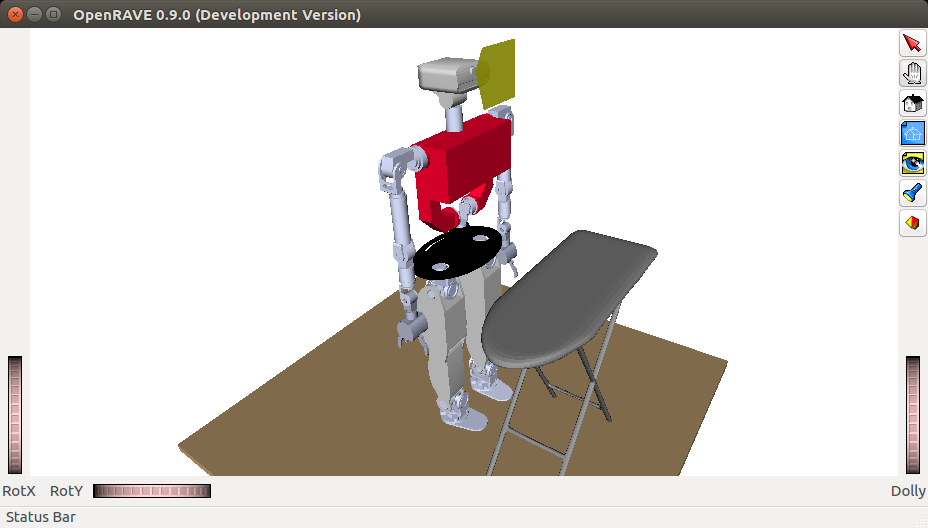

# Tutorial

## Where should I start?

Read the Introduction section of the Developer manual: [Developer Manual (Introduction)](https://robots.uc3m.es/developer-manual/introduction.html)

## Minimum installation for simulator

As a bare minimum to try the simulator, install the following (note: there is a shortcut via the superbuild https://github.com/roboticslab-uc3m/teo-main but let's follow this minimalistic procedure instead), each with their own dependencies:

- [openrave-yarp-plugins](https://github.com/roboticslab-uc3m/openrave-yarp-plugins)
- [teo-openrave-models](https://github.com/roboticslab-uc3m/teo-openrave-models)
- [teo-configuration-files](https://github.com/roboticslab-uc3m/teo-configuration-files)
- [tools](https://github.com/roboticslab-uc3m/tools)

## Now what can I do?

Now that you have installed the basic TEO simulator, you're probably wondering what to do.

###  Initializing the communication server

Our current implementation uses [YARP](https://robots.uc3m.es/installation-guides/install-yarp.html) for communication. Basic use of YARP requires the use of a centralized server. This server associates the low-level implementation of the communication ports with the names we give them. Before executing any TEO program or application, please launch a YARP server from a terminal:

```bash
yarp server
```

### Launching the simulator through the terminal

Maintaining the YARP server open, launch the simulator from another terminal:

```bash
teoSim
```

You should get a window similar to the one depicted below.


Note that the setup with Dextra hands is via the `teoSim dextra` alternative command.

### Launching the simulator through the YARP application manager

It turns out to be much more practical to launch everything through the YARP application manager.
Close the `teoSim` window, and instead launch the following from the terminal:

```bash
yarpmanager --from applications
```

You should get a window similar to the one depicted below. Navigate through `Applications` > `teoSimBase_App` > right-click on `teoSim` > `Run`


### Activating emulation of underactuated hands

In the YARP application manager instance, navigate through `Applications` > `teoSimBase_App`:

- Right-click on first `RealToSimControlBoard` > `Run`
- Right-click on second `RealToSimControlBoard` > `Run`

You will see no action, but it will provide ports the robot hands that are more similar to the real ones.

### Spawning objects in the simulated environment

In the YARP application manager instance, navigate through `Applications` > `teoSimWorld_App` > right-click on any `openraveYarpWorldClientFile` > `Run`

Activating `floor` and `ironing_table`, you should get a window similar to the one depicted below.



Note that you can directly interface with the world port. While this is considered a bad practice, it is documented at: [roboticslab-uc3m/openrave-yarp-plugins/libraries/OpenravePlugins/OpenraveYarpWorld](https://github.com/roboticslab-uc3m/openrave-yarp-plugins/blob/master/libraries/OpenravePlugins/OpenraveYarpWorld/README.md#interfacing-with-openraveyarpworld)

### Interfacing with the robot

Great news! Interfacing with the robot in simulation will be exactly the same as with the real robot! 2x1! Yay! It in fact shares common interfaces with all YARP-speaking robots! Nx1!!

Essentially, we can interact with the robot:

1. Directly talking to ports. This is considered a **bad practice when APIs are available**, but use cases include: fumbling around on a day just like today, speaking with a port with no API (e.g. no client network wrapper), debugging, or just plain laziness. Our own set of hacks (it's hackish because protocols may be subject to change) can be found at: [yarp-tricks (from developer-manual)](https://robots.uc3m.es/developer-manual/appendix/yarp-tricks.html)
2. Via GUI. In certain cases, we have GUIs!
3. **Best practice:** Within our programs and scripts, using the APIs provided by YARP. They are available in many programming languages (C++, Python, MATLAB...). Our own set of examples can be found at: [examples (from yarp-devices)](https://github.com/roboticslab-uc3m/yarp-devices/tree/master/examples)

Next, continue to the dedicated sections:

- [Motor Control](motor.md)
- [RGB-D Sensor](rgbd.md)
- [Mesh From Real Depth](mesh.md)
- [Scene Reconstruction](kinfu.md)
- [Force/Torque Sensors](ft.md)
