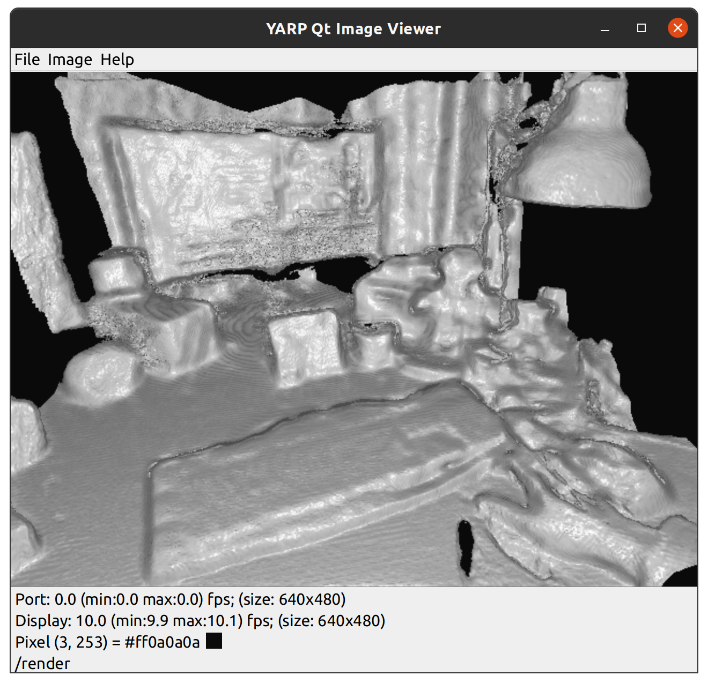

# Tutorial: Scene Reconstruction

Popular RGBD cameras such as the Kinect sensor or the Intel RealSense devices can be used as 3D scanners in conjunction with free software. This tutorial explores a YARP service that runs the popular KinectFusion algorithm (as implemented in OpenCV) under the hood, then it shows how to perform proper scene reconstruction: convert a point cloud to a 3D surface with vertices and faces. The result of each step will be saved to disk so that it can be viewed and optionally processed with any 3D mesh editor such as MeshLab.

### Pre-requisites

OpenCV 4.x is the minimum version at which the OpenCV project provided a KinectFusion implementation. However, as of 4.8.0, this algorithm still remains in the contrib repository and it is hidden behind a CMake flag due to licensing limitations. Follow the [instructions](https://github.com/roboticslab-uc3m/installation-guides/blob/master/docs/install-opencv.md) to build OpenCV 4.x with contrib from sources.

During the configuration step, tell CMake how to find the contrib modules (make sure opencv/opencv_contrib was cloned):

```
cmake /source/dir -DOPENCV_EXTRA_MODULES_PATH=/path/to/opencv/contrib/modules
```

Also, enable those components that have special licensing (such as KinectFusion):

```
cmake /source/dir -DOPENCV_ENABLE_NONFREE=TRUE
```

If you can use `ccmake` to inspect the final configuration, check that `BUILD_opencv_rgbd` is set to `ON`.

In order to perform mesh reconstruction, PCL will be used under the hood (check the [installation guide](https://github.com/roboticslab-uc3m/installation-guides/blob/master/docs/install-pcl.md)).

In order to build our components, YARP will be needed ([instructions](https://github.com/roboticslab-uc3m/installation-guides/blob/master/docs/install-yarp.md)).

Finally, clone and build our [vision-related repository](https://github.com/roboticslab-uc3m/vision). If OpenCV has been correctly installed, the *sceneReconstruction* application should be available. In addition, also set `ENABLE_examples` to `ON` or, alternatively, build the *exampleSceneReconstructionClient* app independently (in examples/cpp/).

### Live 3D scanning with a depth sensor

Once the necessary dependencies and the vision repository are installed, plug in your RGBD sensor of choice and launch the *sceneReconstruction* app. Since we mostly use the RealSense D435i camera, there already exists a configuration file that loads the corresponding acquisition device:

```
sceneReconstruction --from sceneReconstruction-realsense2.ini
```

This will open two ports (default naming unless configured otherwise): the RPC interface `/sceneReconstruction/rpc:s` and the rendered mono image `/sceneReconstruction/render:o`. Now it is advised to create a camera visor through *yarpview* and connect it to the render port:

```
yarpview --name /render
yarp connect /sceneReconstruction/render:o /render
```

At first, it will show a blank image until the service is started. To achieve that, launch the RPC interface:

```
yarp rpc /sceneReconstruction/rpc:s
```

Available commands can be inspected with `help`. We need just two of them: `resume` (for starting or resuming the scene reconstruction) and `pause` (to actually generate a scene from previous frames). The workflow is as follows:

1. Send a `resume` command.
2. Manually scan the desired object with your camera; inspect the live render on the *yarpview* window for feedback.
3. Once ready, send the `pause` command.

The rendered output could look as follows:



Note: in the past and on certain hardware configurations, OpenCL could throw an exception related to the maximum work-group size requested by OpenCV. See [this issue](https://github.com/opencv/opencv_contrib/issues/2422) for an easy workaround if the issue is still present.

### Offline scene reconstruction: from a point cloud to a mesh

Now, it is desirable to fetch the resulting point cloud from the generated 3D render, and reconstruct a mesh from those points. This can be achieved with the *exampleSceneReconstructionClient* app. Don't close the *sceneReconstruction* service yet (it will be queried for data).

However, first you need to assemble a mesh reconstruction pipeline. The general procedure is described [here](https://robots.uc3m.es/vision/yarpcloudutils.html) ([Markdown](https://github.com/roboticslab-uc3m/vision/blob/master/libraries/YarpCloudUtils/README.md)) and all available PCL algorithms are listed. A good start is the following configuration, to be placed in a *pipeline.ini* file:

```ini
[meshPipeline downsample]
algorithm "VoxelGrid"
leafSize 0.02f

[meshPipeline estimate]
algorithm "NormalEstimationOMP"
kSearch 40

[meshPipeline reconstruct]
algorithm "Poisson"
```

There are three steps in this pipeline: downsampling (not mandatory), normal estimation, mesh reconstruction. Sometimes, Poisson may fail on downsampled data, in which case this step should be removed.

Run the following command from the vision project's build tree (the app is *not* installed), passing the correct path to *pipeline.ini*.

```
exampleSceneReconstructionClient --cloud cloud.ply --mesh mesh.ply --from pipeline.ini
```

The point cloud obtained through KinectFusion will be stored in binary format in cloud.ply. The resulting mesh reconstruction will be stored in mesh.ply. Launch the command with `--help` for more options.

### Hints

- Our *sceneReconstruction* service maps YARP configuration parameters (either via .ini or through command line) to KinFu options. Check the *sceneReconstruction.ini* file at the vision repository for current defaults. Adjust for better resolution, memory usage, scanned volume, etc.

- It might be interesting to defer the reconstruction process, i.e. ask the *exampleSceneReconstructionClient* app to only save the point cloud to disk, then perform the remaining steps by other means. Since the point cloud format used is standard (PLY), you might resort to your preferred software to obtain the final mesh from the stored cloud. If you still want to stick with PCL and our handy wrappers, there is another pair of sample apps in the vision repo for your convenience: *exampleProcessCloud* (in: point cloud, out: transformed/filtered/smoothened/etc. point cloud) and *exampleMeshFromCloud* (in: point cloud, out: mesh).
