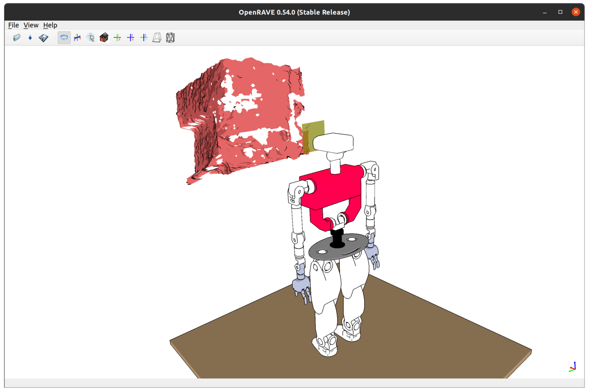

# Tutorial: Mesh From Real Depth

It is possible to achieve some sort of mixed reality (MR) through the representation of real-world objects in the simulated environment.
We'll be using a real RGB-D sensor for this purpose, piping captured depth frames through a mesh reconstruction pipeline and then loading
and rendering the resulting surface mesh in the virtual world.

**Note:** the techniques explained in this tutorial require the availability of a real depth sensor (ideally, the RGB-D camera on TEO's head
due to involved transformations) and the compilation of *YarpCloudUtils* library from [roboticslab-uc3m/vision](https://github.com/roboticslab-uc3m/vision)
with PCL support.

Before proceeding with the following sections, make sure you have launched the real sensor.
In the YARP application manager instance, navigate through `Applications` > `teoBase_App` > right-click on the `yarpdev` corresponding to `--context sensors` > `Run`

### Rendering still surface meshes from live RGBD

Objects in a real environment depicted in **a single depth frame** captured by the real sensor can be represented in the virtual teoSim environment following a surface reconstruction process.

Assuming you have already launched the real sensor, in the YARP application manager instance navigate through `Applications` > `teoSimWorld_App` > right-click on `openraveYarpWorldClientMesh` > `Run`

### Rendering dynamic surface meshes from live RGBD

You can also take a **stream of live depth frames** and continuously render their reconstructed surface mesh in the virtual environment.
Keep in mind this can be CPU-consuming and the quality of the resulting render highly depends on the resolution of the depth frames,
the resolution of the mesh itself according to the selected parameters, and the period of the overall acquire-and-process cycle.

In the YARP application manager instance, navigate through `Applications` > `teoSimBase_App` > right-click on the `openraveYarpPluginLoaderClient` corresponding to the `YarpOpenraveMeshFromRealDepth` > `Run`
