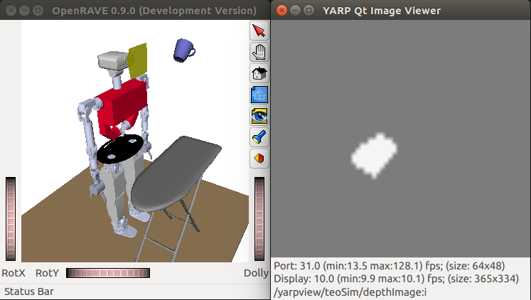

# Tutorial: RGB-D Sensor

First, activate the `teoSim` RGB-D Sensor: In the YARP application manager instance, navigate through `Applications` > `teoSimBase_App` > right-click on the `openraveYarpPluginLoaderClient` corresponding to `RGBDSensorWrapper` > `Run`

## Via GUIs

To view the depth image, perform the sequence:

1. In the YARP application manager instance, navigate through `Applications` > `teoSimTools_App` > right-click on the `yarpview` corresponding to the `depthImage` > `Run`
2. In the YARP application manager instance, navigate through `Applications` > `teoSimTools_App` > right-click on the connection (bottom frame) corresponding to the `depthImage` > `Connect`

Spawning the `mug` object as explained previously, you should get results similar to the figure below.

## Via APIs

The preferred approach, using the APIs provided by YARP within our programs and scripts.

- APIs
  - [yarp::dev::IRGBDSensor](http://www.yarp.it/classyarp_1_1dev_1_1IRGBDSensor.html)
  - Implementation in simulator
    - [roboticslab::YarpOpenraveRGBDSensor](https://robots.uc3m.es/openrave-yarp-plugins/classroboticslab_1_1YarpOpenraveRGBDSensor.html)
    - [openrave-yarp-plugins/libraries/YarpPlugins/YarpOpenraveRGBDSensor](https://github.com/roboticslab-uc3m/openrave-yarp-plugins/tree/master/libraries/YarpPlugins/YarpOpenraveRGBDSensor)
- Examples
  - C++
    - [vision/programs/colorRegionDetection](https://github.com/roboticslab-uc3m/vision/tree/master/programs/colorRegionDetection)
    - [vision/programs/haarDetection](https://github.com/roboticslab-uc3m/vision/tree/master/programs/haarDetection)
