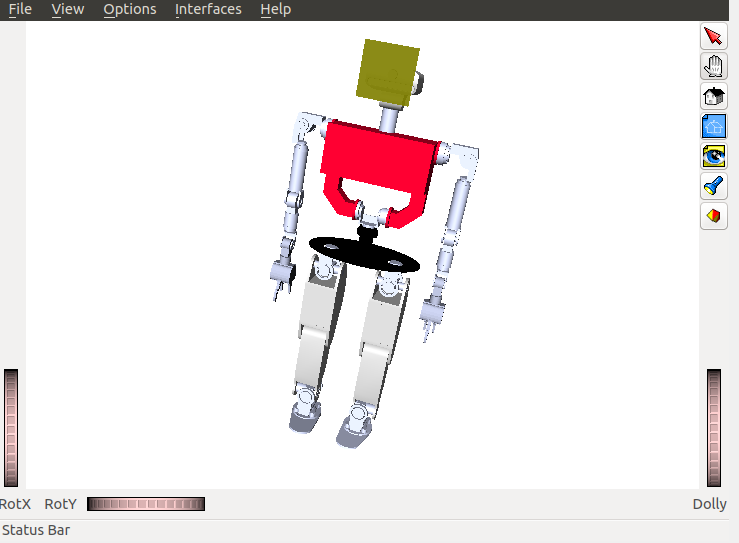
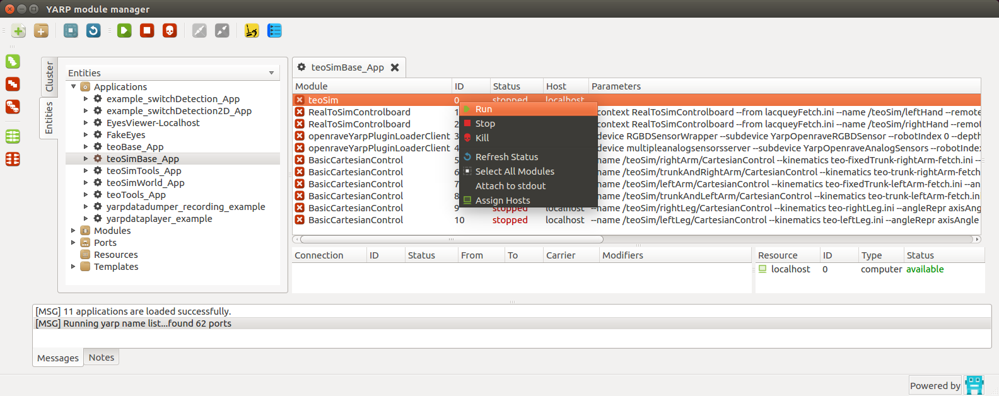

# Introduction

## Where should I start?

Read the Introduction section of the Developer manual: [Developer Manual (Introduction)](http://robots.uc3m.es/gitbook-developer-manual/introduction.html)

As a bare minimum to try the simulator, install the following (note: there is a shortcut via the superbuild https://github.com/roboticslab-uc3m/teo-main but let's follow this minimalistic procedure instead), each with their own dependencies:
- https://github.com/roboticslab-uc3m/openrave-yarp-plugins
- https://github.com/roboticslab-uc3m/teo-openrave-models
- https://github.com/roboticslab-uc3m/teo-configuration-files

## Now what can I do?

Now that you have installed the basic TEO simulator, you're probably wondering what to do.

###  Initializing the communication server

Our current implementation uses [YARP](http://eris.liralab.it/yarpdoc/what_is_yarp.html) for communication. Basic use of YARP requires the use of a centralized server. This server associates the low-level implementation of the communication ports with the names we give them. Before executing any TEO program or application, please launch a YARP server from a terminal:

```bash
yarp server
```

### Launching the simulator through the terminal

Maintaining the YARP server open, launch the simulator from another terminal:

```bash
teoSim
```

You should get a window similar to the one depicted below.



### Launching the simulator through the application manager

It turns out to be much more practical to launch everything through the YARP application manager.
Close the `teoSim` window, and instead launch the following from the terminal:

```bash
yarpmanager --from applications
```

You should get a window similar to the one depicted below. Navigate through `Applications` > `teoSimBase_App` > right-click on `teoSim` > `Run`



### Interfacing with the robot

Great news! Interfacing with the robot in simulation will be exactly the same as with the real robot! 2x1! Yay! It in fact shares common interfaces with all YARP-speaking robots! Nx1!!

Essentially, we can interact with the robot (if these points seem too vague or general, feel free to jump directly to the [motor control](#interfacing-with-the-robot-motor-control) section):
1. Directly talking to ports. This is considered a **bad practice when APIs are available**, but use cases include: fumbling around on a day just like today, speaking with a port with no API (e.g. no client network wrapper), debugging, or just plain laziness. Our own set of hacks (it's hackish because protocols may be subject to change) can be found at: [yarp-tricks (from developer-manual)](http://robots.uc3m.es/gitbook-developer-manual/appendix/yarp-tricks.html)
2. Via GUI. In certain cases, we have GUIs!
3. **Best practice:** Within our programs and scripts, using the APIs provided by YARP. They are available in many programming languages (C++, Python, MATLAB...). Our own set of examples can be found at: [examples (from yarp-devices)](https://github.com/roboticslab-uc3m/yarp-devices/tree/master/examples)

### Interfacing with the robot: Motor Control

Throughout this section, refer to the [Joint Indexes (YARP ports)](diagrams.html#joint-indexes)  diagram to see port names and joint indexes, as well as the [Joint Directions of Rotation](diagrams.html#joint-directions-of-rotation) diagram.

1. Directly talking to ports. From a terminal, connect to the limb you prefer (substitute `leftArm` following the above mentioned diagram):

  ```bash
  yarp rpc /teoSim/leftArm/rpc:i
  ```

  From within this, we can send joint space movements, read encoders, etc. For instance, send an absolute joint position command, to joint 0, setting the target to -45 degrees:

  ```
  set pos 0 -45
  ```

  You should in turn receive should get some kind of feedback, such as:

  ```
  Response: [ok]
  ```

  In line with the hacks mentioned above, refer to a more exhaustive list at: [yarp-tricks: remote_controlboard (from developer-manual)](http://robots.uc3m.es/gitbook-developer-manual/appendix/yarp-tricks.html#remotecontrolboard)

2. Via GUIs. Two options to launch the YARP motor GUI for `teoSim`:
    - Via terminal:
    ```
    yarpmotorgui --from yarpmotorgui/teoSim.ini
    ```
    - Via the application manager (better practice): Navigate through `Applications` > `teoSimTools_App` > right-click on `yarpmotorgui` > `Run`

  Any of the two options, and clicking `OK` (ignore the current warnings regarding hands for now) should get you a window similar to the one depicted below.

  

3. Within our programs and scripts, using the APIs provided by YARP. Also see [iCub-main: Getting accustomed with motor interfaces](https://robotology.github.io/robotology-documentation/doc/html/icub_motor_control_tutorial.html), but in the `remote` line, switch from `/icubSim/right_arm` to `/teoSim/leftArm` or the limb of your selection.
