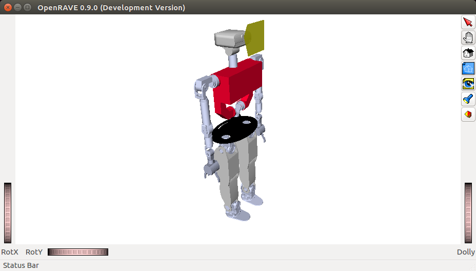

# Introduction

## Where should I start?

Read the Introduction section of the Developer manual: [Developer Manual (Introduction)](http://robots.uc3m.es/gitbook-developer-manual/introduction.html)

As a bare minimum to try the simulator, install the following (note: there is a shortcut via the superbuild https://github.com/roboticslab-uc3m/teo-main but let's follow this minimalistic procedure instead), each with their own dependencies:
- https://github.com/roboticslab-uc3m/openrave-yarp-plugins
- https://github.com/roboticslab-uc3m/teo-openrave-models
- https://github.com/roboticslab-uc3m/teo-configuration-files

## Now what can I do?

Now that you have installed the basic TEO simulator, you're probably wondering what to do.

###  Initializing the communication server

Our current implementation uses [YARP](http://eris.liralab.it/yarpdoc/what_is_yarp.html) for communication. Basic use of YARP requires the use of a centralized server. This server associates the low-level implementation of the communication ports with the names we give them. Before executing any TEO program or application, please launch a yarp server from a terminal:

```bash
yarp server
```

### Launching the simulator through the terminal

Maintaining the YARP server open, launch the simulator from another terminal:

```bash
teoSim
```

You should get a window similar to the one depicted below.



### Launching the simulator through the application manager

It turns out to be much more practical to launch everything throuh the YARP application manager.
Close the `teoSim` window, and instead launch the following from the terminal:

```bash
yarpmanager --from applications
```

You should get a window similar to the one depicted below. Navigate through `Applications` > `teoSimBase_App` > right-click on `teoSim` > `Run`


### Interfacing with teoSim

We can interact with this program through port commands as described below, or through the different language APIs as can be seen in the different [yarp-devices examples](https://github.com/roboticslab-uc3m/yarp-devices/tree/master/examples), for instance the `exampleRemoteControlboard` to move robot joints.

The loaded components open, among others, the server side network wrapper of YARP motor interfaces. While the recommended practice is to communicate via the APIs, we can interface with the opened ports directly from a new terminal via (replace `leftArm` for the limb of your choice, see [Joint Indexes (YARP ports) diagram](diagrams.html#joint-indexes)):

```bash
yarp rpc /teoSim/leftArm/rpc:i
```

From within this, we can send an absolute position joint space movement such as (joint 0, -45 degrees; see [Joint Directions of Rotation diagram](diagrams.html#joint-directions-of-rotation)):

```
set pos 0 -45
```

And should get some kind of feedback, such as:

```
Response: [ok]
```
