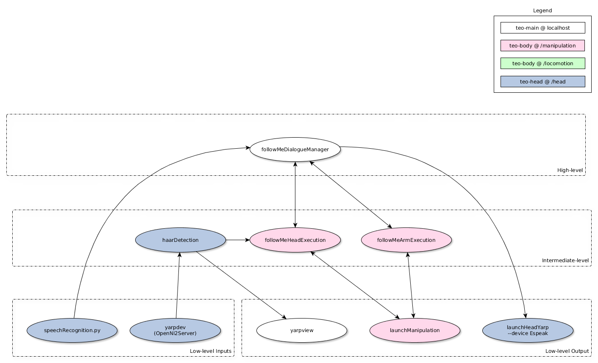

# Overview: Software Architecture

There is technically no fixed software architecture. We use [YARP](http://www.yarp.it/) to implement a loosely coupled program and library infrastructure as described by the [Component-Based Software Engineering (CBSE)](https://en.wikipedia.org/wiki/Component-based_software_engineering) paradigm. XML files describe modules and connections, which can be administered throughout the [TEO cluster](http://robots.uc3m.es/index.php/TEO_Network_information) manually or using a program called [yarpmanager](http://www.yarp.it/yarpmanager.html). During normal operation:
1. The [teoBase XML](https://github.com/roboticslab-uc3m/teo-main/blob/develop/share/teoBase/scripts/teoBase.xml) is launched for basic robot services.
2. The [teoTools XML](https://github.com/roboticslab-uc3m/teo-main/blob/develop/share/teoTools/scripts/teoTools.xml) is launched to assure correct operation of each teoBase service.
3. A final application-level XML is launched, from the [demonstration](overview-demonstration.md) or [research](overview-research.md) repository. 

The following is an example of a good functional working architecture, extracted from the [follow-me](https://github.com/roboticslab-uc3m/follow-me) demonstration repository.

