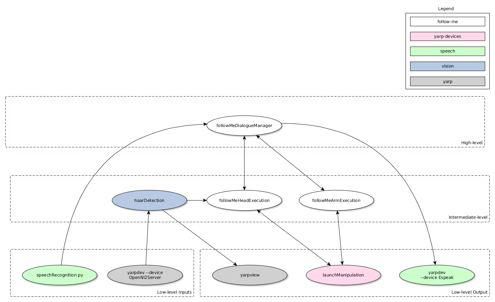

# Overview: Software Architecture

There is technically no fixed software architecture. We use [YARP](http://www.yarp.it/) to implement a loosely coupled program and library infrastructure as described by the [Component-Based Software Engineering (CBSE)](https://en.wikipedia.org/wiki/Component-based_software_engineering) paradigm.

The following is an example of a good working functional architecture.

Which can be found at: [https://github.com/roboticslab-uc3m/follow-me](https://github.com/roboticslab-uc3m/follow-me)

