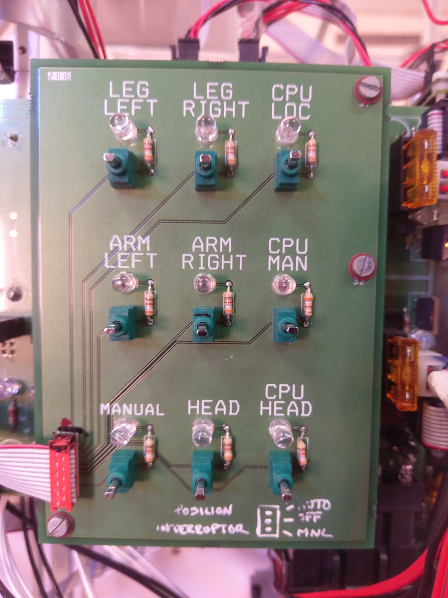
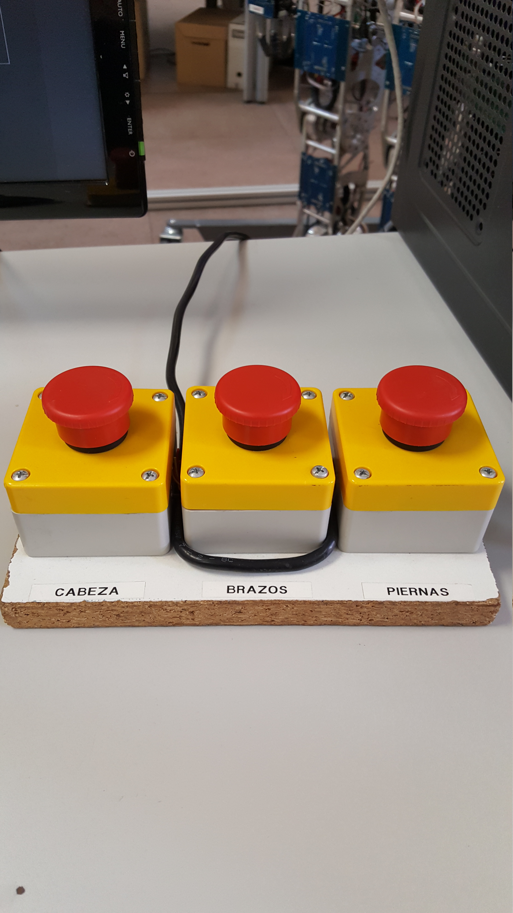

# Switches and Power

| **Main Switches** | **Instructions** |
| --- | --- |
| <a href="fig/power-supply.jpg">

</a> | 
 First, turn on the two main power supplies of TEO (yellow circles) and adjust the voltage to 42 V (red arrows).
|
| <a href="fig/main-switches.jpg">

</a> | 
 Turn on the <strong>General</strong> switch and then turn on the switches corresponding to the label marked on the top of each one.
 |
| <a href="fig/pc-switches.jpg">

</a> | 
 Finally, turn on each of the switches corresponding to the computers. The buttons of the second column are responsible for turning on the computers of the head, manipulation and locomotion in this order. The buttons of the first column are used to reset the computers in the same order as the second column. 
 |
| <a href="fig/emergency-buttons.jpg">

</a> | 
 The emergency buttons will allow us to stop the electricity of motors and drivers of each part of the robot, documented under each button with a label:   head, arms, legs 
 |
