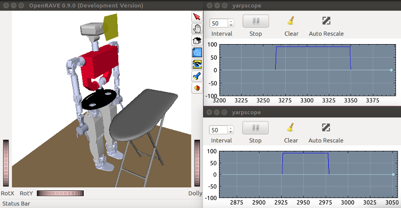

# Tutorial: Force/Torque Sensors

Requires at least YARP 3.4. First, activate the `teoSim` Force/Torque Sensors: In the YARP application manager instance, navigate through `Applications` > `teoSimBase_App` > right-click on the `openraveYarpPluginLoaderClient` corresponding to `multipleanalogsensorsserver` > `Run`

## Via GUIs

To view the force/torque signals, perform the sequence:
1. In the YARP application manager instance, navigate through `Applications` > `teoSimTools_App` > right-click on the corresponding `yarpscope` > `Run`
2. In the YARP application manager instance, navigate through `Applications` > `teoSimTools_App` > right-click on the corresponding (bottom frame) connection > `Connect`

Activate physics and move joints in `teoSim`, and you should get results similar to the figure below.

