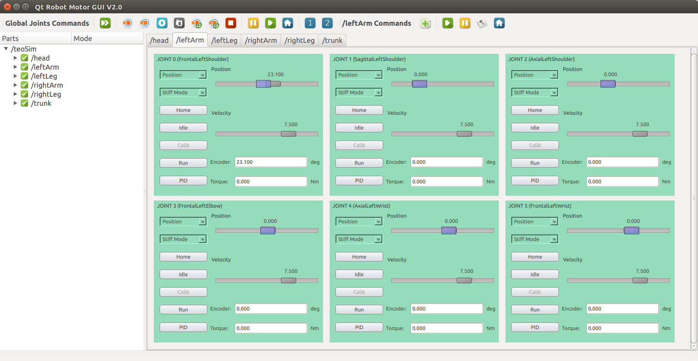

# Tutorial: Motor Control

Throughout this section, refer to the [Joint Indexes (YARP ports)](diagrams.html#joint-indexes)  diagram to see port names and joint indexes, as well as the [Joint Directions of Rotation](diagrams.html#joint-directions-of-rotation) diagram.

## Directly talking to ports

Recall that this is hackish and subject to change. From a terminal, connect to the limb you prefer (substitute `leftArm` following the above mentioned diagram):

```bash
yarp rpc /teoSim/leftArm/rpc:i
```

From within this, we can send joint space movements, read encoders, etc. For instance, send an absolute joint position command, to joint 0, setting the target to -25 degrees:
```
set pos 0 -25
```

You should in turn receive should get some kind of feedback, such as:

```
Response: [ok]
```

In line with the hacks mentioned above, refer to a more exhaustive list at: [yarp-tricks: remote_controlboard (from developer-manual)](http://robots.uc3m.es/gitbook-developer-manual/appendix/yarp-tricks.html#remotecontrolboard)

## Via GUIs

Two options to launch the YARP motor GUI for `teoSim`:

- Via terminal:
  ```
  yarpmotorgui --from yarpmotorgui/teoSim.ini
  ```
- Via the application manager (better practice): Navigate through `Applications` > `teoSimTools_App` > right-click on `yarpmotorgui` > `Run`

Any of the two options, and clicking `OK` (ignore the current warnings regarding hands for now) should get you a window similar to the one depicted below.



## Via APIs

The preferred approach, using the APIs provided by YARP within our programs and scripts.

- APIs
  - [The YARP motor control interfaces](https://www.yarp.it/yarp_motor_control.html)
  - [yarp::dev::IPositionControl](https://www.yarp.it/classyarp_1_1dev_1_1IPositionControl.html)
  - [yarp::dev::IVelocityControl](https://www.yarp.it/classyarp_1_1dev_1_1IVelocityControl.html)
  - [yarp::dev::ITorqueControl](https://www.yarp.it/classyarp_1_1dev_1_1ITorqueControl.html)
  - [yarp::dev::IEncoders](https://www.yarp.it/classyarp_1_1dev_1_1IEncoders.html)
  - Implementation in simulator
    - [roboticslab::YarpOpenraveControlboard](http://robots.uc3m.es/dox-openrave-yarp-plugins/classroboticslab_1_1YarpOpenraveControlboard.html)
    - [openrave-yarp-plugins/libraries/YarpPlugins/YarpOpenraveControlboard](https://github.com/roboticslab-uc3m/openrave-yarp-plugins/tree/master/libraries/YarpPlugins/YarpOpenraveControlboard)
  - Implementation in real robot
    - [roboticslab::CanBusControlboard](http://robots.uc3m.es/dox-yarp-devices/classroboticslab_1_1CanBusControlboard.html)
    - [yarp-devices/libraries/YarpPlugins/CanBusControlboard](https://github.com/roboticslab-uc3m/yarp-devices/tree/master/libraries/YarpPlugins/CanBusControlboard)
- Examples (in the `remote` line, switch to `/teoSim/leftArm` or the limb of your selection)
  - C++
    - [yarp-devices/examples/cpp/exampleRemoteControlboard](https://github.com/roboticslab-uc3m/yarp-devices/tree/master/examples/cpp/exampleRemoteControlboard)
    - [yarp-devices/examples/cpp/exampleRemoteControlboardModule](https://github.com/roboticslab-uc3m/yarp-devices/tree/master/examples/cpp/exampleRemoteControlboardModule)
    - [yarp-devices/examples/cpp/examplePositionDirect](https://github.com/roboticslab-uc3m/yarp-devices/tree/master/examples/cpp/examplePositionDirect)
    - [iCub-main: Getting accustomed with motor interfaces](https://robotology.github.io/robotology-documentation/doc/html/icub_motor_control_tutorial.html)
  - MATLAB
    - [yarp-devices/examples/matlab/exampleRemoteControlboard.m](https://github.com/roboticslab-uc3m/yarp-devices/blob/master/examples/matlab/exampleRemoteControlboard.m)
  - Python
    - [yarp-devices/examples/python/exampleRemoteControlboard.py](https://github.com/roboticslab-uc3m/yarp-devices/blob/master/examples/python/exampleRemoteControlboard.py)
