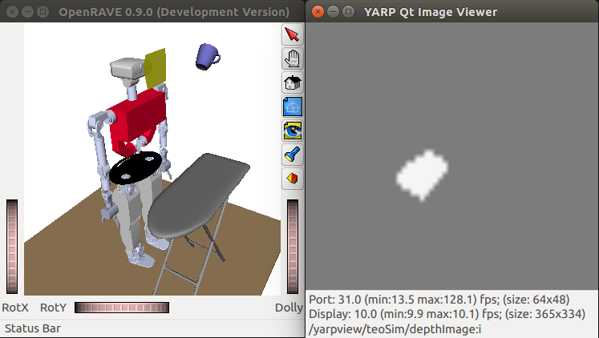

# Tutorial: RGB-D Sensor

First, activate the `teoSim` RGB-D Sensor: In the YARP application manager instance, navigate through `Applications` > `teoSimBase_App` > right-click on the `openraveYarpPluginLoaderClient` corresponding to `RGBDSensorWrapper` > `Run`

1. Via GUIs. Two options to launch the YARP motor GUI for `teoSim`:

  To view the depth image, perform the sequence:
  1. In the YARP application manager instance, navigate through `Applications` > `teoSimTools_App` > right-click on the `yarpview` corresponding to the `depthImage` > `Run`
  2. In the YARP application manager instance, navigate through `Applications` > `teoSimTools_App` > right-click on the connection (bottom frame) corresponding to the `depthImage` > `Connect`

  Spawning the `mug` object as explained previously, you should get results similar to the figure below.

